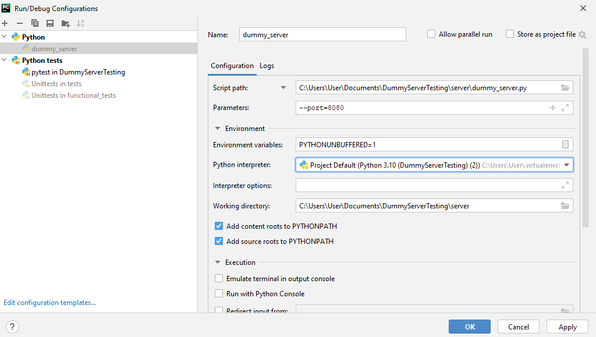
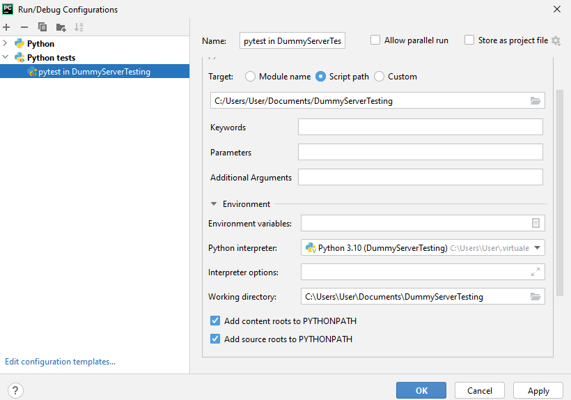

Technical Task for QA automation position
=========================================
@by Alena Damanskaya

Description
----------

## Server
Starts a simple Flask server which supports following REST endpoints:
* GET /people/XX
* GET /planets/XX
* GET /starships/XX  

**Note**: 
  - supported **id** values: numbers from 0 to 99 (inclusive)
  - response body _is same_ for each **id**
  - **id** above 99 will produce 404 not found error
  - **id** in wrong format will produce 400 format error
    
Server is **configurated** either via server/configs/server_configs.yaml or by passing arguments --host, --port, --debug.
Arguments have higher priority.

Server will produce **log file** with all requests and responses. Log file could be found in server/dummy_server.log

All **response data** provided is handled with server/dummy_data_provider.py  
Id param validation hidden behind custom decorator in server/service/request_param_validators/id_validator.py  
Also, GET /people/<id> request will produce response _delays_ (+10 ms increase with each request). This is also  
implemented as decorator, which could be found in server/service/delays_producer.py

**Service entry point** is service/dummy_server.py

## Tests
Tests are written using **pytest** framework. They can be found under tests/ directory.

tests/conftest.py starts server in a separate thread on test session start and teardowns server on test session finish 
(refer to setup_server fixture).

### functional tests
1. positive
  * verify response status code for each endpoint
  * verify response body json structure for each endpoint
  * verify response data compared to https://swapi.dev/ control endpoints  

**Note**: ids are parametrized using boundary method
2. negative
  * verify invalid id format response status code and error for each endpoint
  * verify not found id response status code and error for each endpoint

### performance tests
* verify response mean time for /people/<id> endpoint
* verify response time standard deviation for /people/<id> endpoint <- this test will fail because of delays
* verify response failure rate for /people/<id> endpoint (500 errors only)  

**Note**: test produces X threads as 'clients' who spams requests to the endpoint with Y seconds (these values are
  parametrized, default is 10 clients spam server within 60 seconds)

Setup
-----
**Requirements**: python version 3.11+

> git clone [repo]  
> cd [local repo destination]  
> python -m pip install -r requirements.txt
> set PYTHONPATH=%PYTHONPATH%;[local repo destination]

## Run server

> python server/dummy_server.py

or 

> python server/dummy_server.py --host=127.0.0.1 --port=8080

## Run tests
### all tests

> python -m pytest 

or 

> python -m pytest --host=127.0.0.1 --port=8080

**pycharm configuration**

### specific test suite tests only 
<test_suite> could be:
* functional - includes both positive and negative functional tests
* positive - only positive functional tests
* negative - only negative functional tests
* performance - performance tests only

> python -m pytest -m <test_suite>

or

> python -m pytest -m <test_suite> --host=127.0.0.1 --port=8080

**pycharm configuration**
 